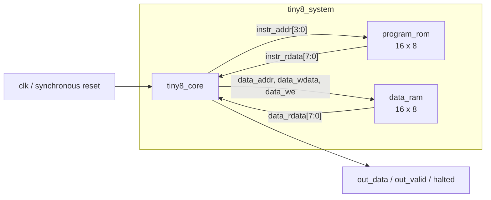
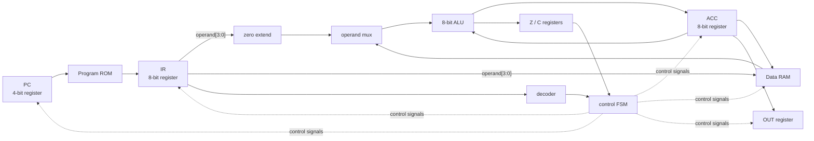
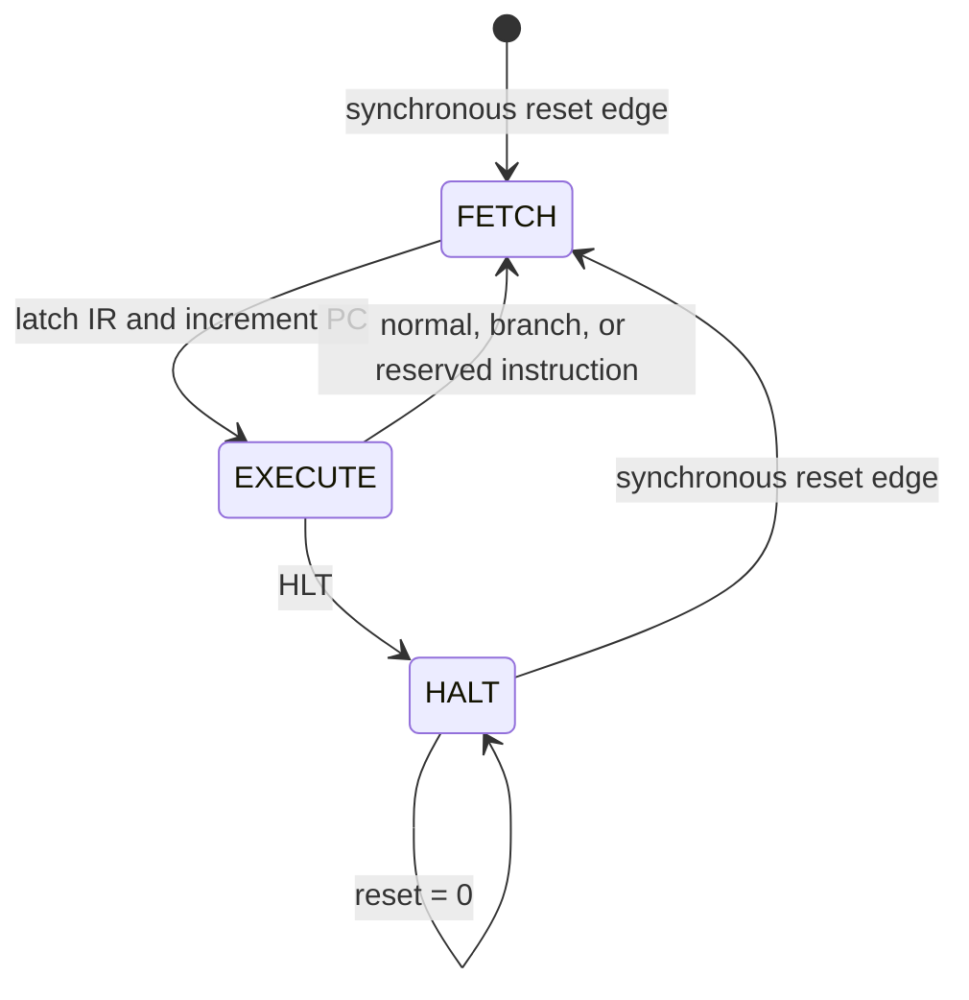

# Tiny8 Architecture

**Architecture version:** 0.1.0 (frozen baseline)

## 1. Structural overview

Tiny8 separates the processor core from both memories. This mirrors a common
real-world design boundary: a core generates memory requests, while a system
wrapper decides which memory implementation supplies the data.



This is Harvard architecture because instruction and data storage have separate
address and data paths.

## 2. Planned RTL hierarchy

```text
tiny8_system
├── program_rom
├── data_ram
└── tiny8_core
    ├── alu8
    └── control_unit
        └── instruction_decoder
```

`PC`, `IR`, `ACC`, `Z`, `C`, and the output register remain inside
`tiny8_core`. They are not split into one-line wrapper modules because they form
one small datapath and share the same clock/reset contract.

## 3. Planned source files

| File | Hardware responsibility |
|---|---|
| `rtl/tiny8_defs.vh` | Shared opcode, ALU operation, and FSM encodings |
| `rtl/alu8.v` | Combinational `PASS_B`, `ADD`, `SUB`, `AND`, `OR`, `XOR`, `SHL`, `SHR` |
| `rtl/instruction_decoder.v` | Pure combinational opcode-to-control decode |
| `rtl/control_unit.v` | `FETCH/EXECUTE/HALT` state register and gated controls |
| `rtl/program_rom.v` | 16 x 8 combinational-read program memory |
| `rtl/data_ram.v` | 16 x 8 combinational-read, synchronous-write data memory |
| `rtl/tiny8_core.v` | Datapath registers, muxes, ALU connection, memory interface |
| `rtl/tiny8_system.v` | Top-level connection of core, ROM, and RAM |

The header file contains constants only; it does not create hardware.

## 4. Datapath



### Operand path

The ALU always receives `ACC` on input A. Input B is selected from:

- `zero_extend(IR[3:0])` for `LDI`; or
- `data_rdata` for `LDA`, `ADD`, `SUB`, `AND`, `OR`, and `XOR`.

The ALU includes a `PASS_B` operation. Therefore both `LDI` and `LDA` use the
same ALU-to-ACC writeback path as arithmetic and logic instructions. `SHL` and
`SHR` use input A and ignore input B. `Z` is calculated from the value being
written into `ACC`.

### Store path

For `STA`:

```text
data_addr  = IR[3:0]
data_wdata = ACC
data_we    = 1 only during STA's EXECUTE phase
```

### Program-counter path

`PC` has two mutually exclusive update controls:

- increment by one during `FETCH`; or
- load `IR[3:0]` during a taken `JMP` or `JZ` in `EXECUTE`.

Four-bit addition naturally wraps from `4'hF` to `4'h0`.

## 5. Control path

The instruction decoder maps `IR[7:4]` to a control description. The control
unit gates that description according to the FSM state and `Z` flag. The decoder
does not contain state or storage.

Final control signals are:

| Signal | Meaning when high/selected |
|---|---|
| `ir_we` | Load Program ROM data into `IR` |
| `pc_inc` | Increment `PC` modulo 16 |
| `pc_load` | Load the instruction operand into `PC` |
| `acc_we` | Commit ALU result to `ACC` |
| `operand_sel` | Select immediate or Data RAM as ALU input B |
| `alu_op[2:0]` | Select `PASS_B`, `ADD`, `SUB`, `AND`, `OR`, `XOR`, `SHL`, or `SHR` |
| `z_we` | Update `Z` from the committed ACC result |
| `c_we` | Update `C` from ALU carry/no-borrow/shift-out |
| `data_we` | Write `ACC` into Data RAM |
| `out_we` | Write `ACC` into the output register |

Reset forces all write-enable controls low, including `data_we`.

## 6. Finite-state machine



State encoding is fixed at:

| State | Encoding |
|---|---:|
| `FETCH` | `2'b00` |
| `EXECUTE` | `2'b01` |
| `HALT` | `2'b10` |
| invalid/recovery | `2'b11`, recovers to `FETCH` |

The recovery encoding produces no write enables and returns to `FETCH` at the
next rising edge.

## 7. Cycle-level example

Assume `PC=0`, Program ROM location 0 contains `8'h15` (`LDI 5`), and reset has
been released.

| Clock edge | State before edge | Action committed at edge | State after edge |
|---:|---|---|---|
| 1 | `FETCH` | `IR=8'h15`, `PC=1` | `EXECUTE` |
| 2 | `EXECUTE` | `ACC=5`, `Z=0` | `FETCH` |
| 3 | `FETCH` | fetch ROM location 1, `PC=2` | `EXECUTE` |

A jump target is loaded at the `EXECUTE` edge. The target instruction is fetched
on the following `FETCH` edge. There is no branch delay slot.

## 8. Module interfaces

### `alu8`

```text
inputs:  a[7:0], b[7:0], alu_op[2:0]
outputs: result[7:0], carry_out
type:    combinational
```

For `SUB`, `carry_out` implements the no-borrow convention. For shifts it is the
bit shifted out of `a`.

### `instruction_decoder`

```text
input:   opcode[3:0]
outputs: decoded control fields and valid/reserved classification
type:    combinational
```

Every opcode has deterministic outputs; defaults prevent latch inference.

### `control_unit`

```text
inputs:  clk, reset, opcode[3:0], zero_flag
outputs: datapath controls, memory write enable, state[1:0], halted
type:    sequential state register plus combinational next-state/control logic
```

### `program_rom`

```text
parameter: INIT_FILE
input:     addr[3:0]
output:    rdata[7:0]
type:      combinational read, initialized constant memory
```

### `data_ram`

```text
inputs:  clk, we, addr[3:0], wdata[7:0]
output:  rdata[7:0]
type:    combinational read, synchronous write
```

### `tiny8_core`

```text
inputs:
  clk, reset
  instr_rdata[7:0]
  data_rdata[7:0]

outputs:
  instr_addr[3:0]
  data_addr[3:0], data_wdata[7:0], data_we
  out_data[7:0], out_valid, halted
  dbg_pc[3:0], dbg_ir[7:0], dbg_acc[7:0]
  dbg_zero, dbg_carry, dbg_state[1:0]
```

### `tiny8_system`

```text
parameter: PROGRAM_FILE
inputs:    clk, reset
outputs:   out_data[7:0], out_valid, halted, debug outputs
```

It forwards `PROGRAM_FILE` to `program_rom` and contains no instruction logic.

## 9. Synthesis implications

- `PC`, `IR`, `ACC`, flags, FSM state, and output become flip-flops.
- The ALU creates combinational arithmetic/logic, shifts, and mux hardware.
- The decoder and control path create combinational decode logic.
- Program ROM becomes constant memory or optimized logic.
- The small asynchronous-read Data RAM may become distributed memory or
  flip-flops plus muxes rather than an FPGA block RAM.
- Supporting a synchronous-read block RAM would require an extra memory/wait
  state and is deliberately outside this baseline.

The generic Yosys flow confirmed these structural consequences for the complete
baseline hierarchy. The Data RAM expanded to flip-flops and selection logic,
while the Program ROM became combinational constant logic. Mapping to a
technology-specific memory primitive remains target-dependent and is not
claimed.
